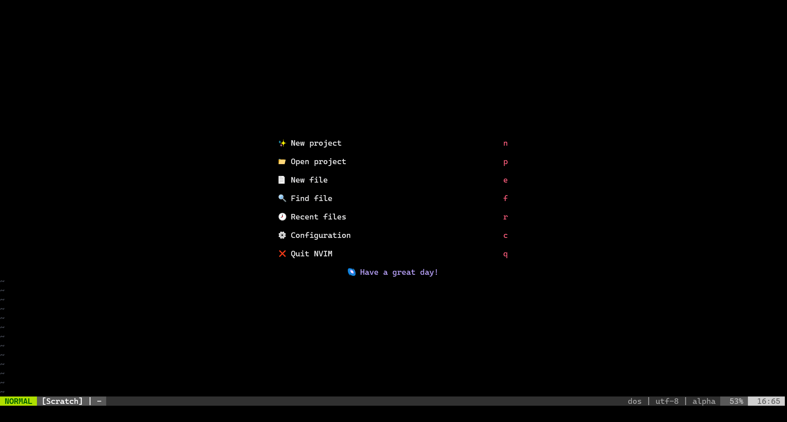
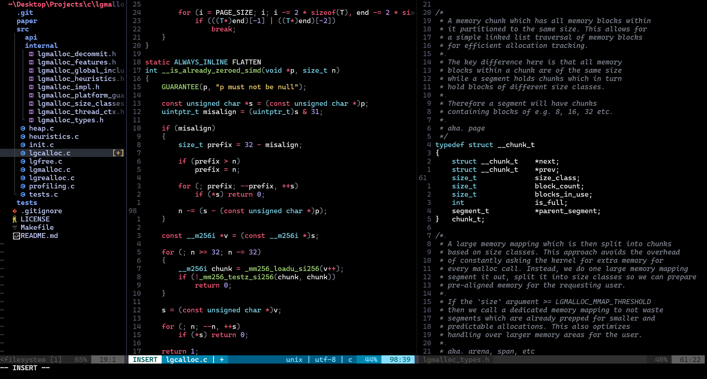

<h1 align="center">✨ Neovim Dotfiles ✨</h1>

<h6 align="center"><em>My Neovim Dotfiles :)</em></h6>

## 📝 Overview

#### THIS IS STILL WIP

After using vscode all my life, I decided it's finally time to move to neovim.
This is my setup and configuration for Windows using [neovide](https://neovide.dev/), which gives me a much nicer experience on native Windows. When I get around to it, I will make this automatically hotswap to a linux config depending on the OS.

## ✨ Showcase

| Main Menu |
|:---------:|
|  |
| <b>Working On Code</b> |
|  |

## ⚠ Issues

- Treesitter struggles a lot with highlighting and compilation
