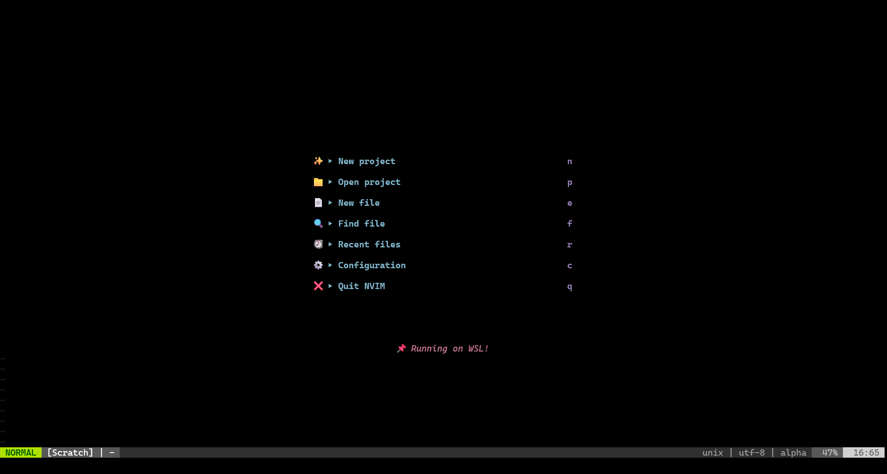
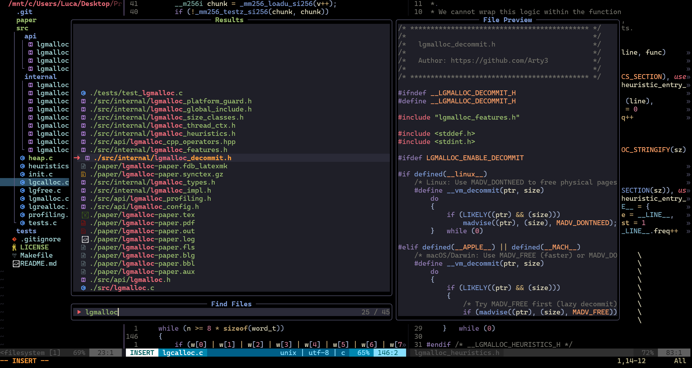
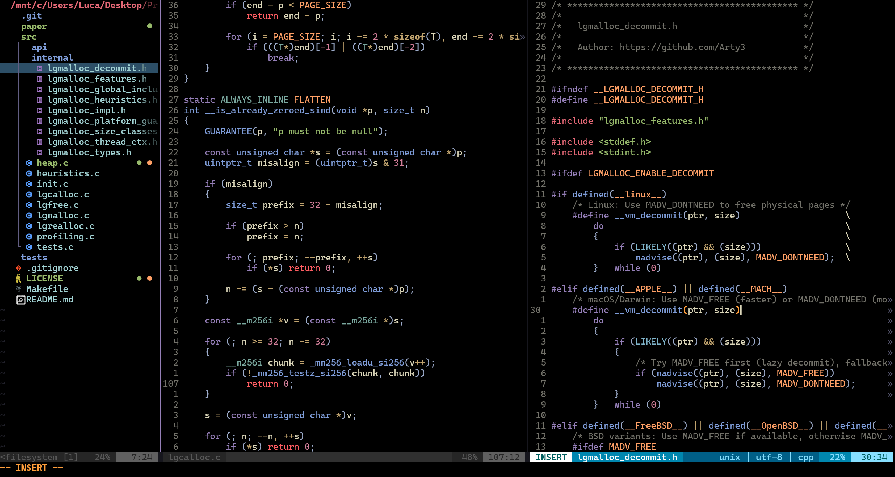
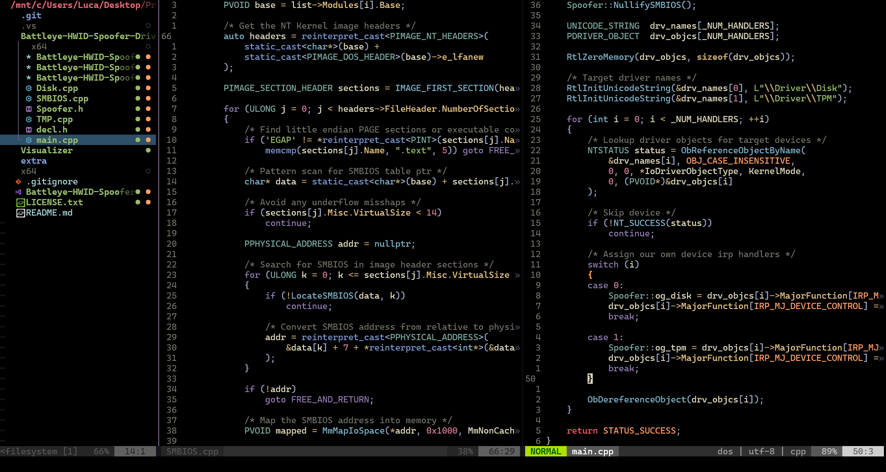
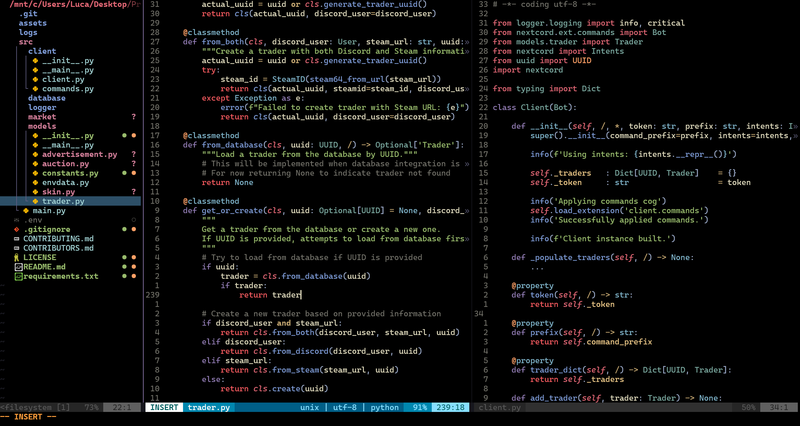
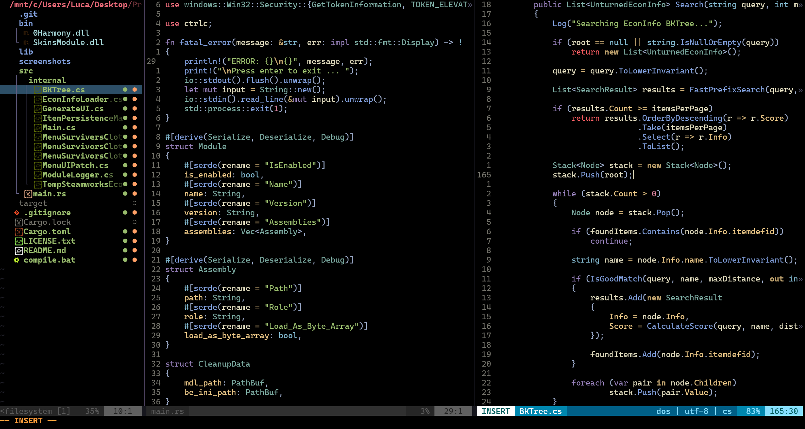

<h1 align="center">✨ Neovim Dotfiles ✨</h1>

<h6 align="center"><em>My Neovim Dotfiles :)</em></h6>

## 📝 Overview

After using vscode all my life, I decided it's finally time to move to neovim.
This is my setup and configuration for Windows using [neovide](https://neovide.dev/), which gives me a much nicer experience on native Windows by integrating
with WSL.

## 🎨 Theme

<div align="left">
	<a href="https://github.com/rebelot/kanagawa.nvim">
		
	</a>
	<div align="left" valign="middle">
		<br><br><br>
		<h2>+ Custom Theming</h2>
	</div>
	<br clear="all">
</div>

## ✨ Showcase

| Main Menu | Fuzzy Finder |
|:---------:|:------------:|
|  |  |
| <b>C</b> | <b>C++</b> |
|  |  |
| <b>Python</b> | <b>Rust + C#</b> |
|  |  |

<h6 align="center"><em>Background is translucent, my wallpaper is just black</em></h6>

## 📌 Notes

### Neovide

I'm using Neovide because I don't like the Windows terminal.
Neovide simply offers me a fast and simple replacement for the GUI,
giving me a much better look and feel on Windows. On my arch laptop,
I don't use it.

### Native Windows + WSL

To make this work correctly, neovide must be run as `neovide --wsl`.
Consider that neovim must be in a standard `PATH` location since
your `.rc` file will not be run, so your custom `PATH` allocations
will not be interpreted.

Neovide will now run with a native Windows GUI, using your WSL neovim, compilers, etc.

You might want to create a shortcut to run `neovide.exe --wsl` and pin it to
your task bar for easy access.

Incase you do wish to switch to native Windows neovim, just run it as normal,
it will still work, and the main menu will let you know what you are running.

Consider that you might find some issues with compilation on native Windows,
I did, hence the switch to WSL.

### Project Manager

I created my own custom project manager for my own project directory.
Consider removing it if you wish to use this.

Otherwise, your projects directory should look as follows:

```
Projects/
├── C/
│   ├── Project1/
│   └── Project2/
└── Python/
    ├── Project1/
    └── Project2/
```

Where each project is categorized by language.

### Custom Theming

I didn't like how plugins auto adapted to the kanagawa theme,
so there is extensive retheming for these components, using the kanagawa palette.
Incase you want to switch color theme, consider removing these.

### Unicode Neovim Bug

Heading to [telescope.lua](./config/after/plugin/telescope.lua), you will find
a problematic section:

```lua
-- Keep as this due to really odd rendering
-- bug with emojis and unicode chars
selection_caret	= "➜  ",
prompt_prefix	= " ▶ ",
multi_icon		= "✓",
```

There is a weird bug in neovim, likely some kind of unicode character rendering issue, where telescope's folder emoji is rendered as a weird unicode character
rather than the emoji itself. This specific selection of unicode characters does not trigger this, but for example, if you were to set `prompt_prefix` to the same
value as `selection_caret`, this will happen.
